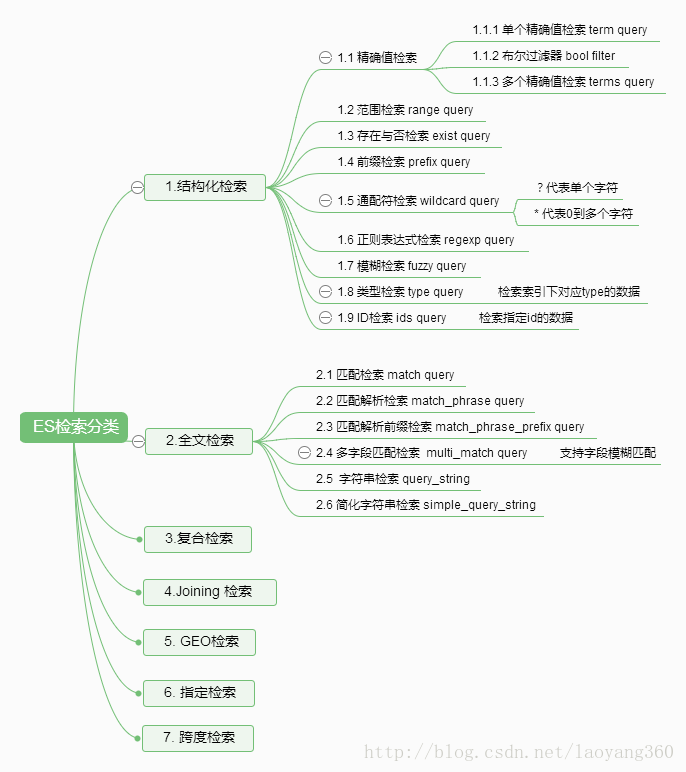

## 概述
Elasticsearch中当我们设置Mapping（分词器、字段类型）完毕后，就可以按照设定的方式导入数据。
有了数据后，我们就需要对数据进行检索操作。根据实际开发需要，往往我们需要支持包含但不限于以下类型的检索： 
- 1）精确匹配，类似mysql中的 “=”操作； 
- 2）模糊匹配，类似mysql中的”like %关键词% “查询操作； 
- 3）前缀匹配； 
- 4）通配符匹配； 
- 5）正则表达式匹配； 
- 6）跨索引匹配； 
- 7）提升精读匹配。

### 检索概览
检索子句的行为取决于查询应用于过滤(filter)上下文还是查询/分析(query)上下文。
#### 过滤上下文——对应于结构化检索
- 1）核心回答的问题是：“这个文档是否符合这个查询条款？” 
- 2）答案是简单的是或否，不计算分数。 
- 3）过滤器上下文主要用于过滤结构化数据。类似于Mysql中判定某个字段是否存在： 

例如： 
- a. 时间戳字段：是否属于2015年或2016年？ 
- b. 状态字段：是否设置为“已发布”？

经常使用的过滤器将被Elasticsearch**自动缓存，以加快性能**。

#### 分析上下文——对应于全文检索 
- 1）核心回答了“本文档与此查询子句是否匹配？”的问题。
- 2）除了决定文档是否匹配之外，查询子句还会计算一个_score，表示文档与其他文档的匹配程度。

综合应用场景如下：
```$xslt
GET /_search
{  "query": {  "bool": {  "must": [
  { "match": { "title": "Search" }},
  { "match": { "content": "Elasticsearch" }}
  ],  "filter": [
  { "term": { "status": "published" }},
  { "range": { "publish_date": { "gte": "2015-01-01" }}}
  ]
  }
  }
}
```


以上检索，title中包含”Search”并且content中包含 “Elasticsearch”，status中精确匹配”published”，并且publish_date 大于“2015-01-01”的全部信息。

以下，以“脑图”的形式直观展示检索分类。



## 结构化搜索
针对字段类型： 日期、时间、数字类型，以及精确的文本匹配。 
结构化检索特点： 
* 1）结构化查询，我们得到的结果 总是 非是即否，要么存于集合之中，要么存在集合之外。 
* 2）结构化查询不关心文件的相关度或评分；它简单的对文档包括或排除处理。

### 精确值查找
#### 单个精确值查找（term query）
term 查询会查找我们指定的精确值。term 查询是简单的，它接受一个字段名以及我们希望查找的数值。

想要类似mysql中如下sql语句的查询操作：

`SELECT document FROM products WHERE price = 20;` 
DSL写法：
```$xslt
GET /my_store/products/_search
{
  "query" : {
  "term" : {
  "price" : 20
  }
  }
}
```

当进行精确值查找时， 我们会使用过滤器（filters）。过滤器很重要，因为它们执行速度非常快，不会计算相关度（直接跳过了整个评分阶段）而且很容易被缓存。如下： 使用 constant_score 查询以非评分模式来执行 term 查询并以一作为统一评分。
```$xslt
GET /my_store/products/_search
{
  "query" : {
  "constant_score" : {
  "filter" : {
  "term" : {
  "price" : 20
  }
  }
  }
  }
}
```

注意：5.xES中，对于字符串类型，要进行精确值匹配。需要将类型设置为text和keyword两种类型。mapping设置如下:
```$xslt
POST testindex/testtype/_mapping
{
   "testtype ":{
  "properties":{
  "title":{
  "type":"text",
  "analyzer":"ik_max_word",
  "search_analyzer":"ik_max_word",
  "fields":{
  "keyword":{
  "type":"keyword"
  }
  }
  }
}
```

精确值java api jest使用方法： 
searchSourceBuilder.query(QueryBuilders.termQuery(“text.keyword”, “来自新华社的报道”));

#### 布尔过滤器
一个 bool 过滤器由三部分组成：
```$xslt
{
   "bool" : {
      "must" :     [],
      "should" :   [],
      "must_not" : [],
      "filter":    []
   }
}
```
- must ——所有的语句都 必须（must） 匹配，与 AND 等价。 
- must_not ——所有的语句都 不能（must not） 匹配，与 NOT 等价。 
- should ——至少有一个语句要匹配，与 OR 等价。 
- filter——必须匹配，运行在非评分&过滤模式。 

当我们需要多个过滤器时，只须将它们置入 bool 过滤器的不同部分即可。

举例：
```$xslt
GET /my_store/products/_search
{
  "query" : {
  "filtered" : {
  "filter" : {
  "bool" : {
  "should" : [
  { "term" : {"price" : 20}},

  { "term" : {"productID" : "XHDK-A-1293-#fJ3"}}

  ],
  "must_not" : {
  "term" : {"price" : 30}

  }
  }
  }
  }
  }
}
```

#### 多个值精确查找（terms query）
```$xslt
{
  "terms" : {
  "price" : [20, 30]
  }
}
```

如上，terms是包含的意思，包含20或者包含30。 
如下实现严格意义的精确值检索， tag_count代表必须匹配的次数为1。
```$xslt
GET /my_index/my_type/_search
{
  "query": {
  "constant_score" : {
  "filter" : {
  "bool" : {
  "must" : [
  { "term" : { "tags" : "search" } },
  { "term" : { "tag_count" : 1 } }
  ]
  }
  }
  }
  }
}
```

### 范围检索（range query）
range 查询可同时提供包含（inclusive）和不包含（exclusive）这两种范围表达式，可供组合的选项如下：
- gt: > 大于（greater than）
- lt: < 小于（less than）
- gte: >= 大于或等于（greater than or equal to）
- lte: <= 小于或等于（less than or equal to）

类似Mysql中的范围查询：
```$xslt
SELECT document
FROM   products
WHERE  price BETWEEN 20 AND 40
```

ES中对应的DSL如下：
```$xslt
GET /my_store/products/_search
{
  "query" : {
  "constant_score" : {
  "filter" : {
  "range" : {
  "price" : {
  "gte" : 20,
  "lt" : 40
  }
  }
  }
  }
  }
}
```

### 存在与否检索（exist query）
mysql中，有如下sql： 
```$xslt
SELECT tags FROM posts WHERE tags IS NOT NULL;
```

ES中，exist查询某个字段是否存在：
```$xslt
GET /my_index/posts/_search
{
    "query" : {
        "constant_score" : {
            "filter" : {
                "exists" : { "field" : "tags" }
            }
        }
    }
}
```

若想要exist查询能匹配null类型，需要设置mapping：
```$xslt
"user": {
  "type": "keyword",
  "null_value": "_null_"
  }
```

missing查询在5.x版本已经不存在，改成如下的判定形式：

```$xslt
GET /_search
{
    "query": {
        "bool": {
            "must_not": {
                "exists": {
                    "field": "user"
                }
            }
        }
    }
}
```


### 前缀检索（ Prefix Query ）
匹配包含 not analyzed 的前缀字符：
```$xslt
GET /_search
{ "query": {
  "prefix" : { "user" : "ki" }
  }
}
```

### 通配符检索( wildcard query)
匹配具有匹配通配符表达式（ (not analyzed ）的字段的文档。 支持的通配符： 
- 1）*，它匹配任何字符序列（包括空字符序列）； 
- 2）？，它匹配任何单个字符。 
请注意，此查询可能很慢，因为它需要遍历多个术语。 
为了防止非常慢的通配符查询，通配符不能以任何一个通配符*或？开头。 
举例：
```$xslt
GET /_search
{
    "query": {
        "wildcard" : { "user" : "ki*y" }
    }
}
```

### 正则表达式检索（regexp query）
正则表达式查询允许您使用正则表达式术语查询。 
举例如下：
```$xslt
GET /_search
{
  "query": {
  "regexp":{
  "name.first": "s.*y"
  }
  }
}
```

注意： *的匹配会非常慢，你需要使用一个长的前缀， 
通常类似.*?+通配符查询的正则检索性能会非常低。

### 模糊检索(fuzzy query)
模糊查询查找在模糊度中指定的最大编辑距离内的所有可能的匹配项，然后检查术语字典，以找出在索引中实际存在待检索的关键词。 
举例如下：
```$xslt
GET /_search
{
  "query": {
  "fuzzy" : { "user" : "ki" }
  }
}
```

### 类型检索（type query）
举例：
```$xslt
GET /my_index/_search
{
  "query": {
  "type" : {
  "value" : "xext"
  }
  }
}
```


已验证，检索索引my_index中，type为xext的全部信息。

###  Ids检索（ids query）
返回指定id的全部信息。
```$xslt
GET /my_index/_search
{
  "query": {
  "ids" : {
  "type" : "xext",
  "values" : ["2", "4", "100"]
  }
  }
}
```

## 全文检索
高级全文查询通常用于在全文本字段（如电子邮件正文）上运行全文查询。他们了解如何对被查询的字段进行分析，并在执行前将每个字段的分析器（或search_analyzer）应用于查询字符串。

### 匹配检索（match query）
匹配查询接受文本/数字/日期类型，分析它们，并构造查询。 
- 1）匹配查询的类型为boolean。 这意味着分析所提供的文本，并且分析过程从提供的文本构造一个布尔查询， 
可以将运算符标志设置为或以控制布尔子句（默认为或）； 
- 2）文本分析取决于mapping中设定的analyzer（中文分词，我们默认选择ik分词器）； 
- 3） fuzziness——模糊性允许基于被查询的字段的类型进行模糊匹配； 
- 4）”operator”: “and”——匹配与操作（默认或操作）； 
- 5）“minimum_should_match”: “75%”——这让我们可以指定必须匹配的词项数用来表示一个文档是否相关。 
举例：
```$xslt
GET /_search
{
    "query": {
        "match" : {
            "message" : {
                "query" : "this is a test",
                "operator" : "and"
            }
        }
    }
}
```

### 匹配解析检索 match_phrase query
match_phrase查询分析文本，并从分析文本中创建短语查询。 
类似 match 查询， match_phrase 查询首先将查询字符串解析成一个词项列表，然后对这些词项进行搜索，但只保留那些包含 全部 搜索词项，且 位置 与搜索词项相同的文档。 
举例如下：对于 quick fox 的短语搜索可能不会匹配到任何文档，因为没有文档包含的 quick 词之后紧跟着 fox 。
```$xslt
GET /my_index/my_type/_search
{
  "query": {
  "match_phrase": {
  "title": "quick brown fox"
  }
  }
}
```

### 匹配解析前缀检索（match_phrase_prefix）
用户已经渐渐习惯在输完查询内容之前，就能为他们展现搜索结果，这就是所谓的 即时搜索（instant search） 或 输入即搜索（search-as-you-type） 。 
不仅用户能在更短的时间内得到搜索结果，我们也能引导用户搜索索引中真实存在的结果。 
例如，如果用户输入 johnnie walker bl ，我们希望在它们完成输入搜索条件前就能得到： 
Johnnie Walker Black Label 和 Johnnie Walker Blue Label 。

match_phrase_prefix与match_phrase相同，除了它允许文本中最后一个术语的前缀匹配。 

举例：
```$xslt
GET / _search
{
    “query”：{
        “match_phrase_prefix”：{
            “message”：“quick brown f”
        }
    }
}
```

### 多字段匹配检索（ multi_match query）
multi_match 查询为能在多个字段上反复执行相同查询提供了一种便捷方式。 
默认情况下，查询的类型是 best_fields， 这表示它会为每个字段生成一个 match 查询。 

举例1："fields": "*_title" 

- 任何与模糊模式正则匹配的字段都会被包括在搜索条件中， 例如可以左侧的方式同时匹配 book_title 、 chapter_title 和 section_title （书名、章名、节名）这三个字段。 

举例2： "fields": [ "*_title", "chapter_title^2" ] 

- 可以使用 ^ 字符语法为单个字段提升权重，在字段名称的末尾添加 ^boost ， 其中 boost 是一个浮点数。 

举例3："fields": [ "first_name", "last_name" ], 
"operator":"and"
- 两个字段必须都包含。
```$xslt
GET /_search
{
  "query": {
  "multi_match" : {
  "query": "this is a test",
  "fields": [ "subject", "message" ]
  }
  }
}
```

### 字符串检索(query_string）
一个使用查询解析器解析其内容的查询。 
query_string查询提供了以简明的简写语法执行多匹配查询 multi_match queries ，布尔查询 bool queries ，提升得分 boosting ，模糊匹配 fuzzy matching ，通配符 wildcards ，正则表达式 regexp 和范围查询 range queries 的方式。 
支持参数达10几种。
```$xslt
GET /_search
{
  "query": {
  "query_string" : {
  "default_field" : "content",
  "query" : "this AND that OR thus"
  }
  }
}
```


### 简化字符串检索（simple_query_string）
一个使用SimpleQueryParser解析其上下文的查询。 与常规query_string查询不同，simple_query_string查询永远不会抛出异常，并丢弃查询的无效部分。 
举例：
```$xslt
GET /_search
{
    "query": {
        "simple_query_string" : {
            "fields" : ["content"],
            "query" : "foo bar -baz"
        }
    }
}
```

支持的操作如下： 
- 1）+表示AND操作 
- 2）| 表示OR操作 
- 3）- 否定操作 
- 4）*在术语结束时表示前缀查询 
- 5）（和）表示优先
