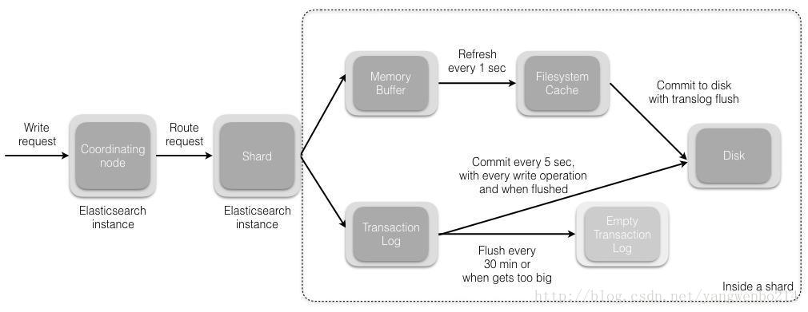
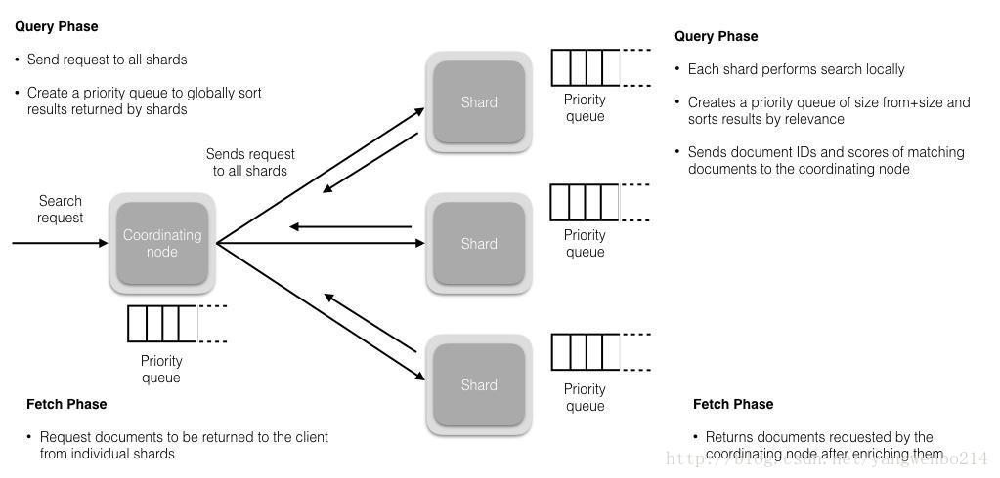
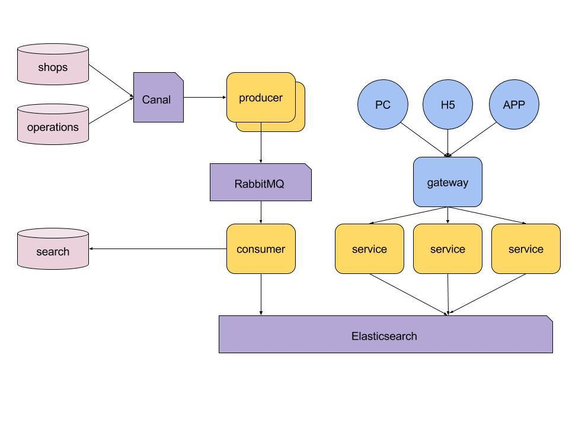

##### 更新文档的时候去访问文档
- 1.get文档
- 2.update文档
- 3.标记删除
- 4.重新index文档

 - Elasticsearch具有近实时的操作和查询数据的能力，默认情况下，从你索引，更新或者删除你的数据到用户可以搜索到新的结果这个过程大概需要1秒（基于refresh 频率）。它们和类似SQL这样的平台不一样，SQL的数据在事务完成后就马上就生效，不会有延迟。文档的变化并不是立即对搜索可见，通过设置refresh_interval设置刷新频率，近实时搜索。
 
 - GET操作默认是实时的，也就是说文档索引后可立即读取，并不像Search需要等待shard刷新，但是通过在GET请求中通过参数realtime=false或者在elasticsearch.yml配置action.get.realtime:false禁用。


#### timeout超时
分片副本不足，设置等待时间。默认情况下，索引操作将在主分片上最多等待1分钟，超过后就会失败并响应错误。 可以通过将值传递给timeout参数来显式更改这个超时值。
```
POST http://localhost:9200/tutorials/chapter/2?timeout = 3m
```
#### Elasticsearch是如何实现Master选举的
Elasticsearch的选主是ZenDiscovery模块负责的，主要包含Ping（节点之间通过这个RPC来发现彼此）和Unicast（单播模块包含一个主机列表以控制哪些节点需要ping通）这两部分；

对所有可以成为master的节点（node.master: true）根据nodeId字典排序，每次选举每个节点都把自己所知道节点排一次序，然后选出第一个（第0位）节点，暂且认为它是master节点。

如果对某个节点的投票数达到一定的值（可以成为master节点数n/2+1）并且该节点自己也选举自己，那这个节点就是master。否则重新选举一直到满足上述条件。

master节点的职责主要包括集群、节点和索引的管理，不负责文档级别的管理；data节点可以关闭http功能。

#### Elasticsearch中的节点（比如共20个），其中的10个选了一个master，另外10个选了另一个master，怎么办？
 - 当集群master候选数量不小于3个时，可以通过设置最少投票通过数量（discovery.zen.minimum_master_nodes）超过所有候选节点一半以上来解决脑裂问题；
 - 当候选数量为两个时，只能修改为唯一的一个master候选，其他作为data节点，避免脑裂问题。
     
#### Elasticsearch是如何避免脑裂现象的
当集群中master候选的个数不小于3个（node.master: 
true）。可以通过discovery.zen.minimum_master_nodes 
这个参数的设置来避免脑裂，设置为(N/2)+1。

这里node.master : true 是说明你是有资格成为master，并不是指你就是master。是皇子，不是皇帝。假如有10个皇子，这里应该设置为（10/2）+1=6，这6个皇子合谋做决策，选出新的皇帝。另外的4个皇子，即使他们全聚一起也才四个人，不足合谋的最低人数限制，他们不能选出新皇帝。

假如discovery.zen.minimum_master_nodes 设置的个数为5，有恰好有10个master备选节点，会出现什么情况呢？5个皇子组成一波，选一个皇帝出来，另外5个皇子也够了人数限制，他们也能选出一个皇帝来。此时一个天下两个皇帝，在es中就是脑裂。

假如集群master候选节点为2的时候，这种情况是不合理的，最好把另外一个node.master改成false。如果我们不改节点设置，还是套上面的(N/2)+1公式，此时discovery.zen.minimum_master_nodes应该设置为2。这就出现一个问题，两个master备选节点，只要有一个挂，就选不出master了。


#### 客户端在和集群连接时，如何选择特定的节点执行请求的？
TransportClient利用transport模块远程连接一个elasticsearch集群。它并不加入到集群中，只是简单的获得一个或者多个初始化的transport地址，并以 轮询 的方式与这些地址进行通信。

#### Elasticsearch 文档索引过程描述
- 协调节点默认使用文档ID参与计算（也支持通过routing），以便为路由提供合适的分片。
```
shard = hash(document_id) % (num_of_primary_shards)
```
- 当分片所在的节点接收到来自协调节点的请求后，会将请求写入到Memory Buffer，然后定时（默认是每隔1秒）写入到Filesystem Cache，这个从Momery Buffer到Filesystem Cache的过程就叫做refresh；
- 当然在某些情况下，存在Momery Buffer和Filesystem Cache的数据可能会丢失，ES是通过translog的机制来保证数据的可靠性的。其实现机制是接收到请求后，同时也会写入到translog中，当Filesystem cache中的数据写入到磁盘中时，才会清除掉，这个过程叫做flush。
- 在flush过程中，内存中的缓冲将被清除，内容被写入一个新段，段的fsync将创建一个新的提交点，并将内容刷新到磁盘，旧的translog将被删除并开始一个新的translog。
- flush触发的时机是定时触发（默认30分钟）或者translog变得太大（默认为512M）时。



关于Lucene的segement（也就是上文中所说的段）的补充：
- Lucene索引是由多个段组成，段本身是一个功能齐全的倒排索引。
- 段是不可变的，允许Lucene将新的文档增量地添加到索引中，而不用从头重建索引。
- 对于每一个搜索请求而言，索引中的所有段都会被搜索，并且每个段会消耗CPU的时钟周、文件句柄和内存。这意味着段的数量越多，搜索性能会越低。
- 为了解决这个问题，Elasticsearch会合并小段到一个较大的段，提交新的合并段到磁盘，并删除那些旧的小段

#### Elasticsearch 文档更新和删除过程描述
- 删除和更新也都是写操作，但是Elasticsearch中的文档是不可变的，因此不能被删除或者改动以展示其变更；

- 磁盘上的每个段都有一个相应的.del文件。当删除请求发送后，文档并没有真的被删除，而是在.del文件中被标记为删除。该文档依然能匹配查询，但是会在结果中被过滤掉。当段合并时，在.del文件中被标记为删除的文档将不会被写入新段。

- 在新的文档被创建时，Elasticsearch会为该文档指定一个版本号，当执行更新时，旧版本的文档在.del文件中被标记为删除，新版本的文档被索引到一个新段。旧版本的文档依然能匹配查询，但是会在结果中被过滤掉。

#### Elasticsearch搜索的过程描述
- 搜索被执行成一个两阶段过程，我们称之为 Query Then Fetch

- 在初始查询阶段时，查询会广播到索引中每一个分片拷贝（主分片或者副本分片）。 每个分片在本地执行搜索并构建一个匹配文档的大小为 from + size 的优先队列。PS：在搜索的时候是会查询Filesystem Cache的，但是有部分数据还在Memory Buffer，所以搜索是近实时的。

- 每个分片返回各自优先队列中 所有文档的 ID 和排序值 给协调节点，它合并这些值到自己的优先队列中来产生一个全局排序后的结果列表。

- 接下来就是 取回阶段，协调节点辨别出哪些文档需要被取回并向相关的分片提交多个 GET 请求。每个分片加载并丰富文档，如果有需要的话，接着返回文档给协调节点。一旦所有的文档都被取回了，协调节点返回结果给客户端。
```
补充：Query Then Fetch的搜索类型在文档相关性打分的时候参考的是本分片的数据，这样在文档数量较少的时候可能不够准确，DFS Query Then Fetch增加了一个预查询的处理，询问Term和Document frequency，这个评分更准确，但是性能会变差。
```



#### 在并发情况下，Elasticsearch如果保证读写一致？
- 可以通过版本号使用乐观并发控制，以确保新版本不会被旧版本覆盖，由应用层来处理具体的冲突；

- 另外对于写操作，一致性级别支持quorum/one/all，默认为quorum，即只有当大多数分片可用时才允许写操作。但即使大多数可用，也可能存在因为网络等原因导致写入副本失败，这样该副本被认为故障，分片将会在一个不同的节点上重建。

- 对于读操作，可以设置replication为sync(默认)，这使得操作在主分片和副本分片都完成后才会返回；如果设置replication为async时，也可以通过设置搜索请求参数_preference为primary来查询主分片，确保文档是最新版本。

#### Elasticsearch在部署时，对Linux的设置有哪些优化方法？
- 64 GB 内存的机器是非常理想的， 但是32 GB 和16 GB 机器也是很常见的。少于8 GB 会适得其反。
- 如果你要在更快的 CPUs 和更多的核心之间选择，选择更多的核心更好。多个内核提供的额外并发远胜过稍微快一点点的时钟频率。
- 如果你负担得起 SSD，它将远远超出任何旋转介质。 基于 SSD 的节点，查询和索引性能都有提升。如果你负担得起，SSD 是一个好的选择。
- 即使数据中心们近在咫尺，也要避免集群跨越多个数据中心。绝对要避免集群跨越大的地理距离。
- 请确保运行你应用程序的 JVM 和服务器的 JVM 是完全一样的。 在 Elasticsearch 的几个地方，使用 Java 的本地序列化。
- 通过设置gateway.recover_after_nodes、gateway.expected_nodes、gateway.recover_after_time可以在集群重启的时候避免过多的分片交换，这可能会让数据恢复从数个小时缩短为几秒钟。
- Elasticsearch 默认被配置为使用单播发现，以防止节点无意中加入集群。只有在同一台机器上运行的节点才会自动组成集群。最好使用单播代替组播。
- 不要随意修改垃圾回收器（CMS）和各个线程池的大小。
- 把你的内存的（少于）一半给 Lucene（但不要超过 32 GB！），通过ES_HEAP_SIZE 环境变量设置。
- 内存交换到磁盘对服务器性能来说是致命的。如果内存交换到磁盘上，一个 100 微秒的操作可能变成 10 毫秒。 再想想那么多 10 微秒的操作时延累加起来。 不难看出 swapping 对于性能是多么可怕。
- Lucene 使用了大量的文件。同时，Elasticsearch 在节点和 HTTP 客户端之间进行通信也使用了大量的套接字。 所有这一切都需要足够的文件描述符。你应该增加你的文件描述符，设置一个很大的值，如 64,000。

#####补充：索引阶段性能提升方法
- 使用批量请求并调整其大小：每次批量数据 5–15 MB 大是个不错的起始点。
- 段和段合并：Elasticsearch 默认值是 20 MB/s，对机械磁盘应该是个不错的设置。如果你用的是 SSD，可以考虑提高到 100–200 MB/s。如果你在做批量导入，完全不在意搜索，你可以彻底关掉合并限流。另外还可以增加 index.translog.flush_threshold_size 设置，从默认的 512 MB 到更大一些的值，比如 1 GB，这可以在一次清空触发的时候在事务日志里积累出更大的段。
- 如果你的搜索结果不需要近实时的准确度，考虑把每个索引的index.refresh_interval 改到30s。
- 如果你在做大批量导入，考虑通过设置index.number_of_replicas: 0 关闭副本。

#### 对于GC方面，在使用Elasticsearch时要注意什么？
- SEE：https://elasticsearch.cn/article/32

- 倒排词典的索引需要常驻内存，无法GC，需要监控data node上segment memory增长趋势。

- 各类缓存，field cache, filter cache, indexing cache, bulk queue等等，要设置合理的大小，并且要应该根据最坏的情况来看heap是否够用，也就是各类缓存全部占满的时候，还有heap空间可以分配给其他任务吗？避免采用clear cache等“自欺欺人”的方式来释放内存。

- 避免返回大量结果集的搜索与聚合。确实需要大量拉取数据的场景，可以采用scan & scroll api来实现。

- cluster stats驻留内存并无法水平扩展，超大规模集群可以考虑分拆成多个集群通过tribe node连接。

- 想知道heap够不够，必须结合实际应用场景，并对集群的heap使用情况做持续的监控。

#### 在Elasticsearch中，是怎么根据一个词找到对应的倒排索引的？
SEE：
- [Lucene的索引文件格式](http://www.cnblogs.com/forfuture1978/archive/2009/12/14/1623597.html)
- [Lucene的索引文件格式(2)](http://www.cnblogs.com/forfuture1978/archive/2009/12/14/1623597.html)

#### Elasticsearch对于大数据量（上亿量级）的聚合如何实现？
Elasticsearch 提供的首个近似聚合是cardinality 度量。它提供一个字段的基数，即该字段的distinct或者unique值的数目。它是基于HLL算法的。HLL 会先对我们的输入作哈希运算，然后根据哈希运算的结果中的 bits 做概率估算从而得到基数。其特点是：可配置的精度，用来控制内存的使用（更精确 ＝ 更多内存）；小的数据集精度是非常高的；我们可以通过配置参数，来设置去重需要的固定内存使用量。无论数千还是数十亿的唯一值，内存使用量只与你配置的精确度相关。

#### 电商搜索的整体技术架构

